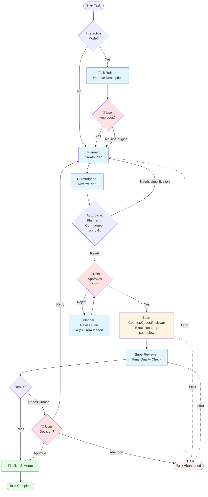
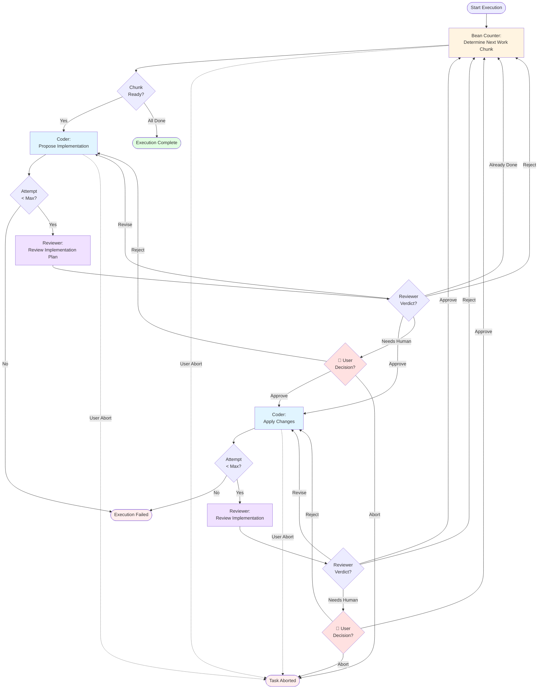

# Agneto State Machines

This document visualizes the two-level state machine architecture in Agneto.

## Task State Machine (Parent - Overall Task Lifecycle)

## Execution State Machine (Bean Counter/Coder/Reviewer Loop)

## User Interaction Points Summary

### Task State Machine
| State | Interaction | Trigger Event | User Options |
|-------|-------------|---------------|--------------|
| `TASK_REFINING` | Task refinement approval | After Task Refiner proposes refinement | Approve (REFINEMENT_COMPLETE) / Reject (REFINEMENT_CANCELLED) |
| `TASK_CURMUDGEONING` | Plan approval after Curmudgeon review | After Planner ↔ Curmudgeon auto-cycles complete (up to 4x) | Approve (CURMUDGEON_APPROVED) / Reject (CURMUDGEON_SIMPLIFY)* |
| `TASK_SUPER_REVIEWING` | Final review decision | SuperReviewer returns NEEDS_HUMAN | Approve (HUMAN_APPROVED) / Retry (HUMAN_RETRY) / Abandon (HUMAN_ABANDON) |

\* **Note:** After the first user review (approve or reject), subsequent planning iterations skip Curmudgeon review. User becomes the reviewer for all revisions.

### Execution State Machine
| State | Interaction | Trigger Event | User Options |
|-------|-------------|---------------|--------------|
| `PLAN_REVIEW` | Plan needs human review | Reviewer returns NEEDS_HUMAN for plan | Approve / Reject / Provide feedback |
| `CODE_REVIEW` | Code needs human review | Reviewer returns NEEDS_HUMAN for code | Approve / Reject / Provide feedback |
| Any state | User abort | User requests abort (Ctrl+C, etc.) | Task transitions to TASK_ABORTED |

## Architecture Notes

- **Two-level architecture**: The Task State Machine manages the overall lifecycle, while the Execution State Machine handles the Bean Counter/Coder/Reviewer loop
- **TASK_EXECUTING delegates**: When the Task State Machine enters `TASK_EXECUTING`, it creates and runs an Execution State Machine
- **Conservative by design**: Multiple review points ensure quality and give users control
- **Non-interactive mode**: Skips `TASK_REFINING` and `TASK_CURMUDGEONING` approval points
- **Session-based**: Bean Counter maintains progress ledger across chunks; Coder and Reviewer have separate sessions
- **Error recovery**: Both machines handle errors gracefully with retries and fallbacks
- **Curmudgeon auto-cycles**: Planner ↔ Curmudgeon automatically cycles up to 4 times to simplify over-engineered plans before showing to user
- **User-driven revisions skip Curmudgeon**: Once user reviews a plan (approve or reject), subsequent revisions skip Curmudgeon review - user becomes the reviewer
